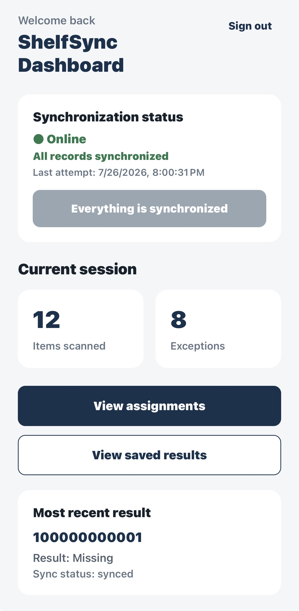
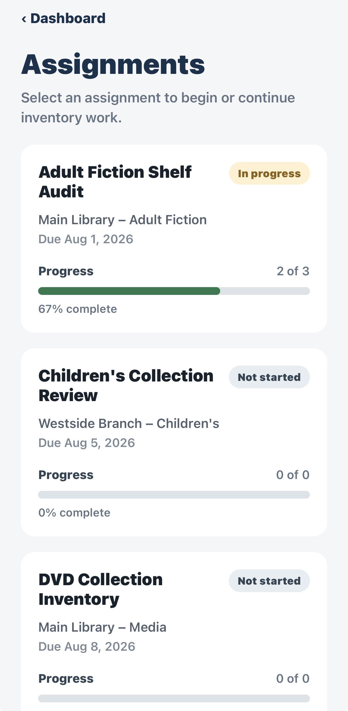
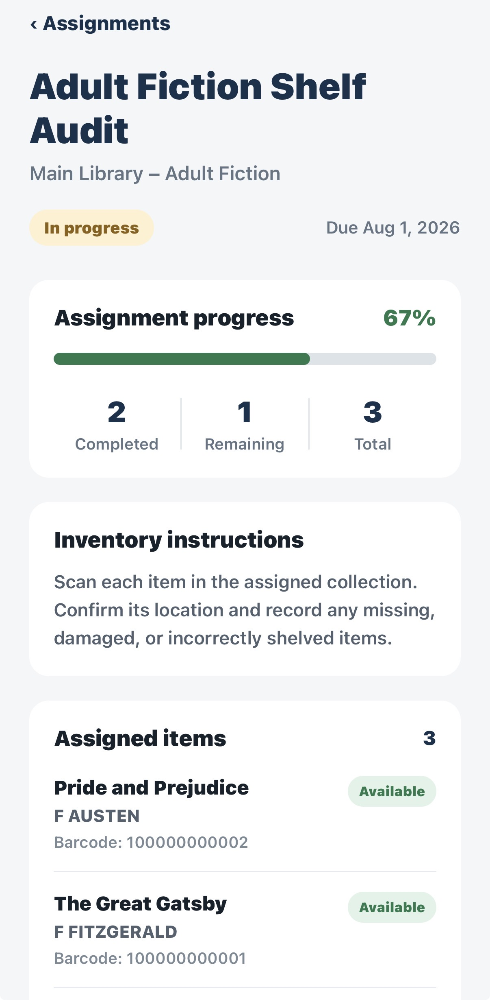
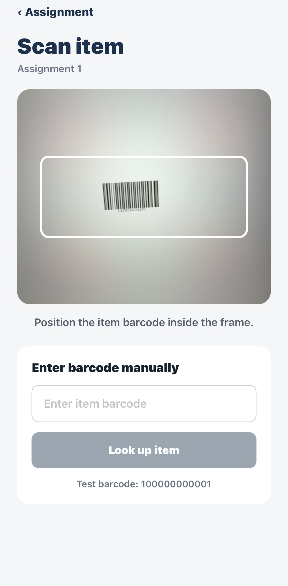
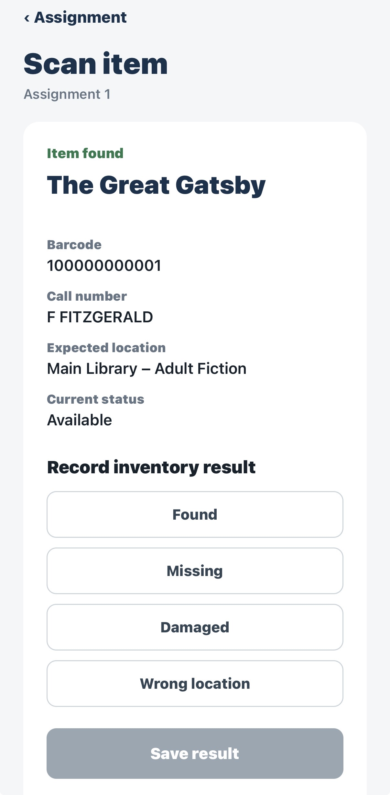

# ShelfSync

ShelfSync is a full-stack mobile inventory application designed for library staff. It allows staff members to open inventory assignments, scan item barcodes, record inventory results, work offline, and synchronize completed records with a PostgreSQL database.

The project demonstrates mobile development, API design, GraphQL, offline state management, database persistence, automated testing, and production build validation.

---

## Project Overview

Library inventory work often requires staff to move through shelves while checking whether items are present, missing, damaged, or incorrectly shelved.

ShelfSync provides a mobile workflow for this process:

1. A staff member opens an assigned inventory task.
2. The app displays the assignment location, progress, and expected items.
3. The staff member scans or manually enters an item barcode.
4. ShelfSync looks up the item through the GraphQL API.
5. The staff member records the inventory result.
6. The result is saved locally as a pending record.
7. Pending records are synchronized with the backend when a network connection is available.
8. The backend stores the records in PostgreSQL and recalculates assignment progress.

---

## Features

- Mobile inventory assignments
- Barcode scanning with the device camera
- Manual barcode entry
- GraphQL item lookup
- Assignment detail and progress tracking
- Inventory result recording
- Offline-first local storage
- Pending, synchronized, and failed record states
- Manual synchronization with the backend
- Automatic assignment progress recalculation
- Automatic screen refresh when returning to assignments
- Network connection status
- PostgreSQL database persistence
- REST inventory synchronization endpoint
- GraphQL assignment and item queries
- Automated Redux reducer tests
- TypeScript validation
- ESLint validation
- Production exports for Android, iOS, and web

---

## Inventory Results

Staff can record several possible inventory outcomes for each scanned item, including:

- Found
- Missing
- Damaged
- Incorrectly shelved

The result is first stored on the device and marked as `pending`.

After synchronization:

- Successful records become `synced`.
- Rejected or unreachable records become `failed`.
- Failed records can be retried during a later synchronization attempt.

---

## Application Workflow

```text
Staff opens assignment
        ↓
Staff scans or enters barcode
        ↓
Mobile app sends GraphQL item lookup
        ↓
Staff selects inventory result
        ↓
Redux stores record locally as pending
        ↓
User starts synchronization
        ↓
REST API receives pending records
        ↓
Prisma writes records to PostgreSQL
        ↓
Backend recalculates assignment progress
        ↓
Mobile app reloads updated assignment data
```

---

## Architecture

ShelfSync is divided into a mobile application and a backend API.

```text
ShelfSync
│
├── Expo React Native mobile app
│   ├── Expo Router navigation
│   ├── Camera barcode scanner
│   ├── Redux Toolkit state management
│   ├── Redux Persist and AsyncStorage
│   ├── GraphQL queries
│   └── REST synchronization
│
├── Node.js backend
│   ├── Express
│   ├── Apollo Server
│   ├── GraphQL API
│   ├── REST API
│   └── Prisma ORM
│
└── Neon PostgreSQL database
    ├── Assignments
    ├── Library items
    └── Inventory records
```

---

## Technology Stack

### Mobile Application

- React Native
- Expo
- Expo Router
- TypeScript
- Expo Camera
- Redux Toolkit
- React Redux
- Redux Persist
- AsyncStorage
- NetInfo

### Backend

- Node.js
- TypeScript
- Express
- Apollo Server
- GraphQL
- Prisma ORM
- PostgreSQL

### Database

- Neon PostgreSQL

### Testing and Validation

- Vitest
- ESLint
- TypeScript compiler
- Expo production export

---

## Project Structure

```text
ShelfSync54/
│
├── app/
│   ├── _layout.tsx
│   ├── index.tsx
│   ├── dashboard.tsx
│   ├── assignments.tsx
│   ├── results.tsx
│   └── assignment/
│       ├── [id].tsx
│       └── [id]/
│           └── scan.tsx
│
├── data/
│   └── mockData.ts
│
├── lib/
│   ├── api.ts
│   └── graphql.ts
│
├── store/
│   ├── hooks.ts
│   ├── index.ts
│   ├── inventorySlice.ts
│   └── inventorySlice.test.ts
│
├── server/
│   ├── prisma/
│   ├── src/
│   │   └── index.ts
│   ├── package.json
│   └── tsconfig.json
│
├── .env
├── package.json
└── README.md
```

---

## GraphQL API

The backend provides GraphQL queries for assignment and library item data.

### Get all assignments

```graphql
query GetAssignments {
  assignments {
    id
    title
    location
    dueDate
    completedItems
    totalItems
    status
  }
}
```

### Get one assignment

```graphql
query GetAssignment($id: ID!) {
  assignment(id: $id) {
    id
    title
    location
    dueDate
    completedItems
    totalItems
    status
    items {
      id
      barcode
      title
      callNumber
      expectedLocation
      currentStatus
    }
  }
}
```

### Look up an item by barcode

```graphql
query GetLibraryItem($barcode: String!) {
  libraryItem(barcode: $barcode) {
    id
    barcode
    title
    callNumber
    expectedLocation
    currentStatus
    assignmentId
  }
}
```

---

## REST API

### Health Check

```http
GET /health
```

### Synchronize Inventory Records

```http
POST /api/inventory/sync
```

Example request:

```json
{
  "records": [
    {
      "id": "record-id",
      "assignmentId": "1",
      "barcode": "100000000001",
      "result": "Found",
      "recordedAt": "2026-07-26T12:00:00.000Z"
    }
  ]
}
```

The backend stores each accepted record and recalculates the related assignment progress.

---

## Environment Variables

### Mobile Application

Create a `.env` file in the root project folder:

```env
EXPO_PUBLIC_API_BASE_URL=http://YOUR_COMPUTER_IP:4000
```

Example for local network development:

```env
EXPO_PUBLIC_API_BASE_URL=http://192.168.1.200:4000
```

The phone and development computer must be connected to the same local network.

### Backend

Create the backend environment file inside the `server` folder and provide the PostgreSQL connection string required by Prisma.

Do not commit production credentials or database passwords to GitHub.

---

## Local Setup

### Requirements

- Node.js
- npm
- Expo Go or an Android/iOS emulator
- PostgreSQL or a Neon PostgreSQL database
- A phone and computer on the same network for physical-device testing

### Install the Mobile Application

From the root project folder:

```bash
npm install
```

### Install the Backend

```bash
cd server
npm install
```

---

## Start the Backend

From the `server` folder:

```bash
npm run dev
```

The backend exposes:

```text
REST health check:
http://localhost:4000/health

Inventory synchronization:
http://localhost:4000/api/inventory/sync

GraphQL:
http://localhost:4000/graphql
```

Leave the backend terminal running.

---

## Start the Mobile Application

Open a second terminal in the root project folder.

On Windows PowerShell:

```powershell
$env:REACT_NATIVE_PACKAGER_HOSTNAME="YOUR_COMPUTER_IP"
npx expo start --lan --clear
```

Example:

```powershell
$env:REACT_NATIVE_PACKAGER_HOSTNAME="192.168.1.200"
npx expo start --lan --clear
```

Scan the Expo QR code with the mobile device.

---

## Test Barcode

The seeded database includes this test item:

```text
Barcode: 100000000001
Title: The Great Gatsby
```

Enter the barcode manually from the scanner screen to test the GraphQL lookup workflow.

---

## Automated Tests

Run the Redux tests from the root project folder:

```bash
npm test
```

The current test suite verifies that:

- New records are created with a `pending` status.
- Successful synchronization changes records to `synced`.
- Server-rejected records become `failed`.
- Request failures mark pending records as `failed`.

Expected result:

```text
Test Files  1 passed
Tests       4 passed
```

---

## Code Quality Checks

### Mobile Lint Check

From the root project folder:

```bash
npm run lint
```

### Mobile TypeScript Check

```bash
npx tsc --noEmit
```

### Backend TypeScript Check

```bash
cd server
npx tsc --noEmit
```

---

## Production Export

To verify that Expo can generate production bundles:

```bash
npx expo export
```

The project has been successfully exported for:

- Android
- iOS
- Web

The generated production files are placed in:

```text
dist/
```

---

## Screenshots

### Dashboard



### Assignments



### Assignment Detail



### Item Lookup



### Inventory Results



---

## Key Engineering Decisions

### Offline-First Inventory Recording

Inventory work may occur in areas with weak or inconsistent wireless coverage. ShelfSync stores results locally before attempting synchronization, allowing staff to continue working without losing records.

### Separate GraphQL and REST Responsibilities

GraphQL is used for reading structured assignment and item data.

REST is used for sending batches of locally stored inventory records to the server.

This keeps read operations flexible while giving synchronization a clear endpoint.

### Shared GraphQL Request Helper

All mobile GraphQL screens use a shared request function. This avoids duplicating fetch, parsing, and error-handling logic across multiple screens.

### Server-Confirmed Progress

Assignment totals only increase after inventory records are successfully synchronized and stored by the backend.

Pending local records do not count as completed server records until synchronization succeeds.

### Automatic Focus Refresh

Assignment screens reload current backend data when the user returns to them. This prevents stale progress counts from remaining visible after synchronization.

---

## What This Project Demonstrates

ShelfSync demonstrates experience with:

- Building a cross-platform mobile application
- Designing an offline-capable workflow
- Managing application state with Redux Toolkit
- Persisting local data between sessions
- Integrating a mobile camera barcode scanner
- Building GraphQL queries and resolvers
- Building REST synchronization endpoints
- Connecting an API to PostgreSQL
- Using Prisma for database access
- Handling failed network requests
- Tracking synchronization state
- Writing automated reducer tests
- Validating TypeScript across frontend and backend
- Creating production Expo bundles
- Designing software around a real library workflow

---

## Future Improvements

Potential future improvements include:

- Staff authentication and role-based access
- Assignment creation and administration
- Automatic background synchronization
- Conflict resolution for duplicate scans
- Inventory notes and item photographs
- Search and filtering for saved results
- More comprehensive API integration tests
- Deployment of the backend to a public server
- Published Android and iOS builds
- Administrative reporting dashboard

---

## Author

**Richard Hanly**

Digital services and software development professional focused on library systems, mobile workflows, databases, APIs, and operational technology.

- GitHub: https://github.com/richardrhanly-us
- LinkedIn: https://www.linkedin.com/in/richardhanly/